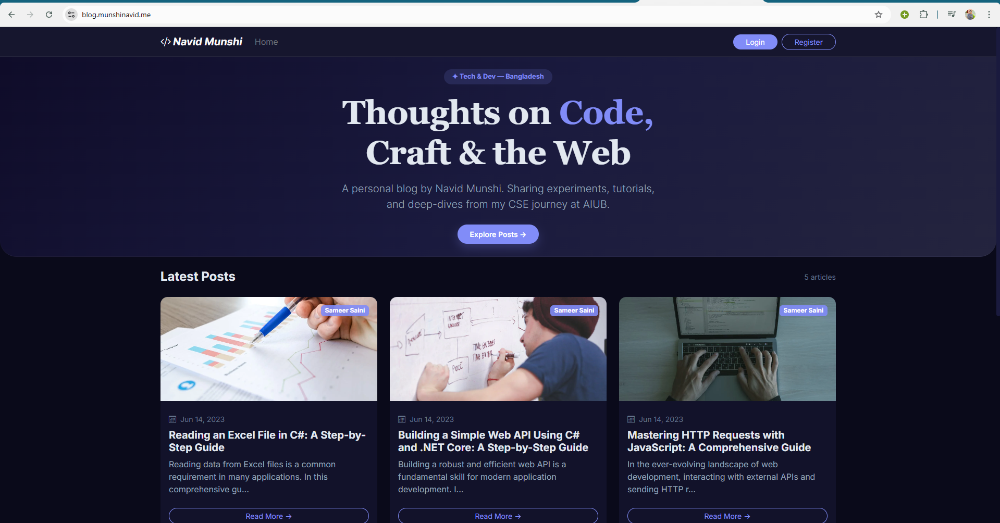
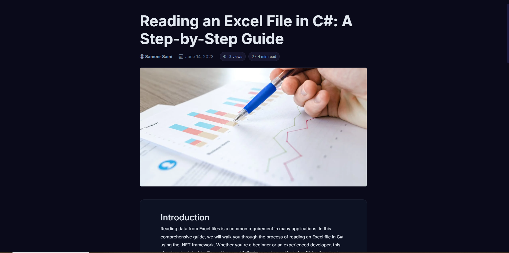
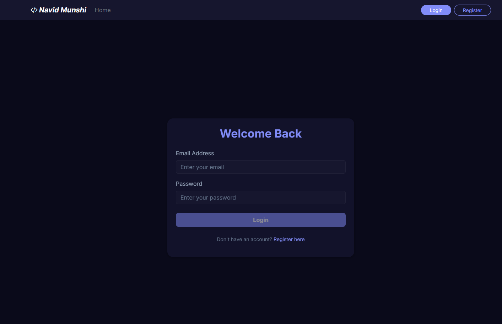
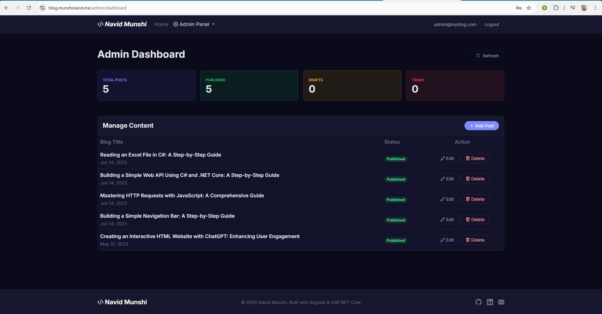
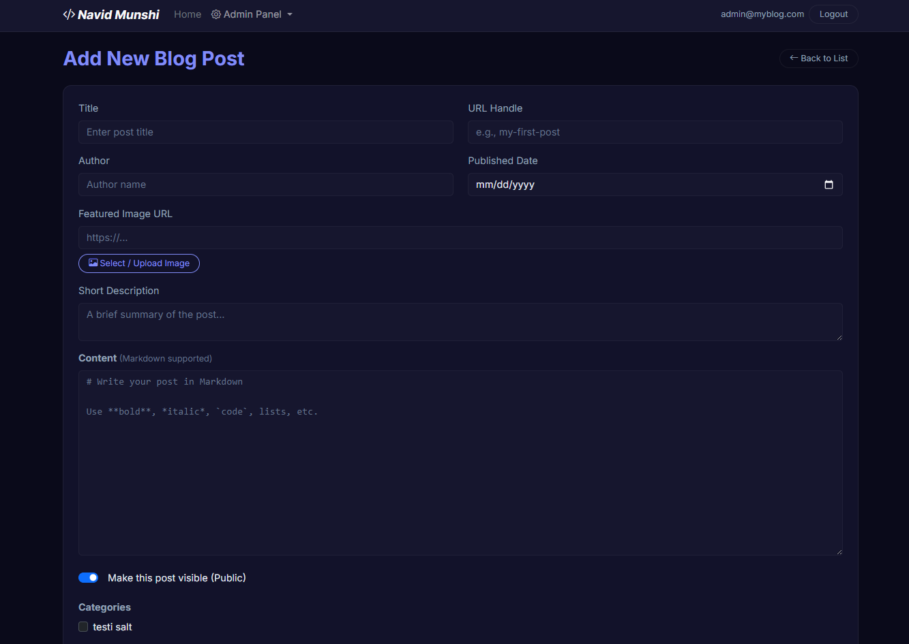
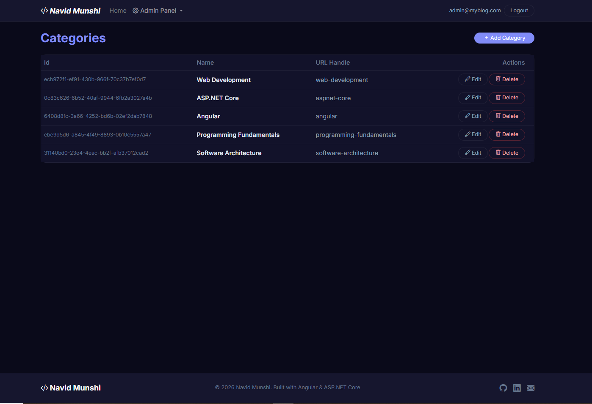

<div align="center">

# ✍️  Fullstack Blog Platform

**A production-deployed blogging platform built with Angular 19, ASP.NET Core 8 Web API, and PostgreSQL.**

[](https://blog.munshinavid.me)
[](https://dotnet.microsoft.com/)
[](https://angular.dev/)
[](https://www.postgresql.org/)
[](https://www.docker.com/)

</div>

---

## 📸 Screenshots

<!-- Replace the placeholder paths below with your actual screenshot paths -->

<details>
<summary><b>🏠 Home / Blog Feed</b></summary>
<br>


<!-- > 📌 *Add screenshot here: `./screenshots/home.png`* -->

</details>

<details>
<summary><b>📖 Blog Post Detail (Markdown Rendered)</b></summary>
<br>


<!-- > 📌 *Add screenshot here: `./screenshots/blog-detail.png`* -->

</details>

<details>
<summary><b>🔐 Login Page</b></summary>
<br>


<!-- > 📌 *Add screenshot here: `./screenshots/login.png`* -->

</details>

<details>
<summary><b>📊 Admin Dashboard</b></summary>
<br>


<!-- > 📌 *Add screenshot here: `./screenshots/admin-dashboard.png`* -->

</details>

<details>
<summary><b>✏️ Create / Edit Blog Post</b></summary>
<br>


<!-- > 📌 *Add screenshot here: `./screenshots/add-blogpost.png`* -->

</details>

<details>
<summary><b>🗂️ Category Management</b></summary>
<br>


<!-- > 📌 *Add screenshot here: `./screenshots/categories.png`* -->

</details>

---

## ⚡ Key Features

| Feature | Description |
|---|---|
| **JWT Auth (HttpOnly Cookies)** | Secure authentication with tokens stored in HttpOnly + Secure + SameSite cookies — preventing XSS token theft |
| **Role-Based Access Control** | Admin and Reader roles with server-side `[Authorize]` enforcement and Angular route guards |
| **Admin Dashboard** | Statistics panel showing total, published, draft, and deleted post counts with full lifecycle management |
| **Post Lifecycle** | Create → Publish → Soft Delete → Restore → Hard Delete — mirrors real CMS workflows |
| **Server-Side Pagination** | Database-level `Skip/Take` pagination with search filtering and max page-size cap (50) |
| **Commenting System** | Authenticated users can post comments; deletion restricted to comment owner or Admin |
| **Markdown Rendering** | Blog content authored in Markdown and rendered as HTML on the frontend |
| **Image Upload** | File upload pipeline with GUID-based naming, metadata persistence, and static file serving |
| **View Count Tracking** | Automatic per-post view counter incremented on each detail page visit |
| **Structured Logging** | Serilog with console + rolling daily file sinks, integrated into global exception handling |

---

## 🏗️ Architecture

```
┌─────────────────────────────────────────────────────┐
│                   Docker Compose                     │
│                                                     │
│  ┌──────────┐   ┌──────────────┐   ┌─────────────┐ │
│  │  Nginx   │   │  ASP.NET     │   │ PostgreSQL  │ │
│  │ (Angular │──▶│  Core 8 API  │──▶│    16       │ │
│  │   SPA)   │   │  Port: 7071  │   │ Port: 5432  │ │
│  │ Port: 80 │   └──────────────┘   └─────────────┘ │
│  └──────────┘           │                           │
│                   ┌─────┴──────┐                    │
│                   │  pgAdmin   │                    │
│                   │ Port: 5050 │                    │
│                   └────────────┘                    │
└─────────────────────────────────────────────────────┘
```

### Backend (ASP.NET Core 8 Web API)
- **Repository Pattern** — All data access behind interfaces with DI registration
- **AutoMapper** — Clean DTO ↔ Domain mapping with a centralized `MappingProfile`
- **FluentValidation** — Declarative request validation rules on incoming DTOs
- **Global Exception Handler** — `IExceptionHandler` implementation mapping exception types → HTTP status codes
- **EF Core Code-First** — Migrations with seeded roles (Admin/Reader) and default admin user
- **Serilog** — Structured logging to console + daily rolling log files

### Frontend (Angular 19 SPA)
- **Standalone Components** — No NgModules, fully standalone architecture
- **Signals + Zone-less** — `provideZonelessChangeDetection()` with Signal-based state management
- **`httpResource`** — Declarative, reactive data fetching for blog posts
- **Lazy-Loaded Routes** — Admin routes loaded on-demand with `loadComponent()`
- **Route Guards** — `canActivate` admin guard checking role from auth signal
- **HTTP Interceptor** — Global interceptor injecting `withCredentials: true` on every request

---

## 🛠️ Tech Stack

| Layer | Technologies |
|---|---|
| **Frontend** | Angular 19, TypeScript, Signals, ngx-markdown, CSS |
| **Backend** | ASP.NET Core 8, C#, Entity Framework Core, ASP.NET Identity |
| **Database** | PostgreSQL 16, EF Core Code-First Migrations |
| **Auth** | JWT Bearer (HMAC-SHA256), HttpOnly Cookies, Role-Based Authorization |
| **Validation** | FluentValidation, Data Annotations |
| **Mapping** | AutoMapper |
| **Logging** | Serilog (Console + File sinks) |
| **API Docs** | Swagger / OpenAPI (Swashbuckle) |
| **Containerization** | Docker, Docker Compose, Multi-stage Builds, Nginx |
| **CI/CD** | GitHub Actions → SSH Deploy → Docker Compose on Linux VPS |
| **Database Admin** | pgAdmin 4 |

---

## 🚀 CI/CD Pipeline

The project uses **GitHub Actions** for automated deployment:

```
Push to main → GitHub Actions → SSH into VPS → git pull → docker compose up --build → Health Check → Prune
```

- Triggers on every push to `main` (+ manual `workflow_dispatch`)
- **Concurrency control** — prevents overlapping deployments
- **Safe reset** — `git fetch --all && git reset --hard origin/main`
- **Zero-downtime rebuild** — `docker compose up -d --build --remove-orphans`
- **Health check** — `curl -f` against the API endpoint post-deploy
- **Cleanup** — `docker image prune -f` to reclaim disk space

---

## 🗄️ Database Schema

```
┌──────────────┐     ┌───────────────────┐     ┌──────────────┐
│   BlogPost   │────▶│ BlogPostCategory  │◀────│   Category   │
│──────────────│     │ (Join Table)      │     │──────────────│
│ Id (PK)      │     │───────────────────│     │ Id (PK)      │
│ Title        │     │ BlogPostId (FK)   │     │ Name         │
│ Content      │     │ CategoryId (FK)   │     │ UrlHandle    │
│ Description  │     └───────────────────┘     └──────────────┘
│ Author       │
│ UrlHandle    │     ┌──────────────┐
│ FeaturedImg  │     │   Comment    │
│ IsVisible    │────▶│──────────────│
│ IsDeleted    │     │ Id (PK)      │
│ ViewCount    │     │ Content      │
│ PublishedDate│     │ BlogPostId   │
└──────────────┘     │ UserId       │
                     │ DateAdded    │
┌──────────────┐     └──────────────┘
│  BlogImage   │
│──────────────│     ┌──────────────────┐
│ Id (PK)      │     │  ASP.NET Identity│
│ FileName     │     │──────────────────│
│ Title        │     │ AspNetUsers      │
│ Extension    │     │ AspNetRoles      │
│ FileSizeBytes│     │ AspNetUserRoles  │
│ Url          │     └──────────────────┘
└──────────────┘
```

- **Many-to-Many**: BlogPost ↔ Category (via `BlogPostCategory` join table)
- **One-to-Many**: BlogPost → Comments
- **Identity Integration**: Comments linked to `AspNetUsers` via `UserId`
- **Seeded Data**: Admin & Reader roles + default admin user provisioned via EF Core migrations

---

## 📁 Project Structure

```
blog-platform/
├── .github/
│   └── workflows/
│       └── deploy.yml              # GitHub Actions CI/CD pipeline
├── api/
│   └── CodePulse.API/
│       ├── Controllers/            # Auth, BlogPosts, Categories, Comments, Images
│       ├── Data/                   # EF Core DbContext with Identity + Seeding
│       ├── Exceptions/             # Global exception handler (IExceptionHandler)
│       ├── Mappings/               # AutoMapper profiles
│       ├── Migrations/             # EF Core Code-First migrations
│       ├── Models/
│       │   ├── Domain/             # BlogPost, Category, Comment, BlogImage
│       │   └── DTO/                # Request/Response DTOs + PagedResultDto
│       ├── Repositories/           # Repository interfaces + implementations
│       ├── Validators/             # FluentValidation rules
│       ├── Dockerfile              # Multi-stage .NET build
│       └── Program.cs              # App configuration, DI, middleware pipeline
├── ui/
│   └── CodePulse-UI/
│       ├── src/app/
│       │   ├── core/               # Navbar, Footer, Route Guards
│       │   ├── features/
│       │   │   ├── admin/          # Dashboard with stats
│       │   │   ├── auth/           # Login, Register, AuthService (Signals)
│       │   │   ├── blogpost/       # CRUD + list + edit (admin)
│       │   │   ├── category/       # Category management
│       │   │   ├── comment/        # Comment section component
│       │   │   └── public/         # Home feed, Blog detail page
│       │   ├── interceptors/       # Auth interceptor (withCredentials)
│       │   └── shared/             # Shared services & components
│       ├── Dockerfile              # Multi-stage Node → Nginx build
│       └── nginx.conf              # SPA routing configuration
└── docker-compose.yml              # 4-service orchestration
```

---

## ⚙️ Getting Started

### Prerequisites

- [Docker](https://docs.docker.com/get-docker/) & Docker Compose
- (Optional) [.NET 8 SDK](https://dotnet.microsoft.com/download) and [Node.js 20+](https://nodejs.org/) for local development

### Run with Docker (Recommended)

```bash
# Clone the repository
git clone https://github.com/munshinavid/fullstack-blog-angular-aspnetcore.git
cd fullstack-blog-angular-aspnetcore

# Create the environment file for JWT secret
echo "JWT_KEY=YourSuperSecretKeyHereMakeItLong123!" > ./api/CodePulse.API/.env

# Start all services
docker compose up -d --build
```

| Service | URL |
|---|---|
| **Blog (Frontend)** | [http://localhost:4200](http://localhost:4200) |
| **API (Swagger)** | [http://localhost:7071/swagger](http://localhost:7071/swagger) |
| **pgAdmin** | [http://localhost:5050](http://localhost:5050) |

### Default Admin Credentials

| Email | Password |
|---|---|
| `admin@myblog.com` | `1234` |

> ⚠️ **Change these immediately in production.** The admin user is seeded via EF Core migrations.

### Local Development (Without Docker)

```bash
# Backend
cd api/CodePulse.API
dotnet restore
dotnet run

# Frontend (in a separate terminal)
cd ui/CodePulse-UI
npm install
ng serve
```

---

## 🔒 Security Highlights

- **HttpOnly + Secure + SameSite cookies** — JWT never exposed to JavaScript
- **Server-side role enforcement** — `[Authorize(Roles = "Admin")]` on all write endpoints
- **Password hashing** — ASP.NET Identity with `PasswordHasher<IdentityUser>`
- **CORS restriction** — Only whitelisted origins allowed
- **Input validation** — FluentValidation on all incoming request DTOs
- **Claims-based ownership** — Comment deletion restricted to owner or admin via `ClaimTypes.NameIdentifier`

---

## 📄 API Endpoints

| Method | Endpoint | Auth | Description |
|---|---|---|---|
| `POST` | `/api/auth/register` | — | Register a new user (Reader role) |
| `POST` | `/api/auth/login` | — | Login and receive HttpOnly JWT cookie |
| `POST` | `/api/auth/logout` | — | Clear JWT cookie |
| `GET` | `/api/auth/me` | ✅ | Get current user from token claims |
| `GET` | `/api/blogposts` | — | Public paginated blog list |
| `GET` | `/api/blogposts/admin` | Admin | All posts (incl. drafts & deleted) |
| `GET` | `/api/blogposts/{id}` | — | Get post by ID (increments view count) |
| `GET` | `/api/blogposts/urlHandle/{url}` | — | Get post by URL slug |
| `POST` | `/api/blogposts` | Admin | Create a new blog post |
| `PUT` | `/api/blogposts/{id}` | Admin | Update blog post + category sync |
| `DELETE` | `/api/blogposts/{id}` | Admin | Soft delete a post |
| `PUT` | `/api/blogposts/restore/{id}` | Admin | Restore a soft-deleted post |
| `DELETE` | `/api/blogposts/hard-delete/{id}` | Admin | Permanently delete a post |
| `GET` | `/api/blogposts/stats` | Admin | Dashboard statistics |
| `GET` | `/api/categories` | — | List all categories |
| `POST` | `/api/categories` | — | Create category |
| `PUT` | `/api/categories/{id}` | — | Update category |
| `DELETE` | `/api/categories/{id}` | — | Delete category |
| `POST` | `/api/comments` | ✅ | Post a comment (user from JWT) |
| `GET` | `/api/comments/post/{id}` | — | Get comments for a blog post |
| `DELETE` | `/api/comments/{id}` | ✅ | Delete comment (owner or Admin) |
| `POST` | `/api/images/upload` | — | Upload an image |
| `GET` | `/api/images` | — | List all uploaded images |

---

## 🤝 Contributing

Contributions, issues, and feature requests are welcome. Feel free to open an issue or submit a pull request.

---

## 📬 Contact

**Navid Munshi** — [blog.munshinavid.me](https://blog.munshinavid.me)

---

<div align="center">

**Built with ❤️ using Angular, .NET, PostgreSQL & Docker**

</div>
